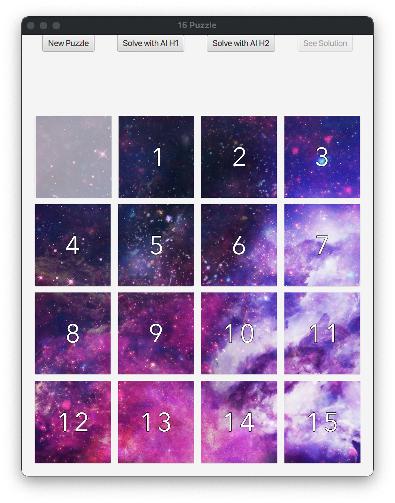

# Threaded-A-Star-15-Puzzle
Classic game of 15 Puzzle with threaded AI path finding using the A-Star search algorithm. CS 342 Project 4, UIC Spring 2021.

## Table of contents
* [General Info](#general-info)
* [Getting Started](#getting-started)
* [Technologies](#technologies)
* [Credits](#credits)
* [Visual Demonstration](#visual-demonstration)

## General info
This project is the fourth project for CS 342 (Software Design) at the University of Illinois at Chicago, Spring 2021. Our task was to develop a JavaFX program that allows the user to attempt to solve different 15 puzzles (more on that below). Our program was required to have a minimum of 10 unique (and solveable) 15 puzzles to solve. If the user can not solve it and wants to see the solution, animated move by move, they can choose to have the AI puzzle solver figure it out with one of two heuristics. Out program was required to use the A\* search algorithm with the ability to use two different heuristics.

## Getting Started
To begin with, you will want to make sure you have all technologies needed. You can use your IDE of choice but Eclipse is **strongly** suggested for this project.
* Java 8: https://www.oracle.com/java/technologies/javase/javase8u211-later-archive-downloads.html
* Maven: https://maven.apache.org/install.html
* JavaFX: https://gluonhq.com/products/javafx/

Once you are ready, import the project into your IDE and run as a Java Application. You will be presented with a welcoming screen before you can begin playing. Once the game screen is present, you are able to begin playing by clicking tiles adjacent to the empty tile. To win the game, one must correctly place the empty tile in the **upper left** corner of the board, and follow with the numerical tiles in ascending order from left to right and top to bottom. Example:

The application has four buttons near the top of the window which provide differing functionality: 
* **"New Puzzle"** will reset the board and then load up a different puzzle from one out of ten presets (which can be changed in the JavaFXTemplate.java file -- please note that some puzzle configurations can ***not*** be solved in 15 Puzzle).
* **"Solve with AI H1"** will begin a back-end pathfinding process using the A\* search algorithm with the Misplaced Tiles heuristic. This process runs on its own thread as to not block the Application thread. Once the path is found, the "See Solution" button will become active, and when pressed, the game will animate the next 10 correct moves for the user. From then, the user will be able to continue playing the game or select a new puzzle to solve.    
* **"Solve with AI H2"** does the same exact thing as "Solve with AI H2" except instead of using the Misplaced Tiles heuristic, the A\* search algorithm utilizes the Manhattan Distance heuristic. 
* **"See Solution"** animates the next 10 moves towards the solution of the current puzzle and is only accessable after clicking either "Solve with AI H1" or "Solve with AI H2". 

***NOTE:*** If you are having issues with installation in Eclipse, the two most common fixes are:
* Run fix: https://stackoverflow.com/a/57747229
* JavaFX fix: https://youtu.be/LOaUsrjJ_rs?t=210
    
## Technologies
Project is created with:
* Eclipse version 2022-06 (4.24.0)
* Apache Maven version 3.8.4
* JavaFX version 12.0.1
* Java SE 8

## Credits
All credits for the project idea go to Professor Mark Hallenbeck. Credits to the [A_IDS_A_15solver.java](src/main/java/A_IDS_A_15solver.java), DB_Solver2.java, Node.java, and Userinterface.java codebase also go to Professor Mark Hallenbeck as the beginning template for our project. Credits to Lyshastra on DeviantArt (https://www.deviantart.com/lyshastra) for the galaxy artwork used on the game tiles as seen within this program. All credits to technologies used are given to their owners and all items specified in their respective licenses are adhered to throughout this project.  

## Visual Demonstration
The following link leads to a visual demonstration of the project.
* https://youtu.be/9GdFLcM8d1k
